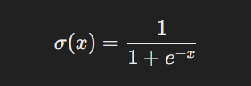
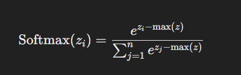
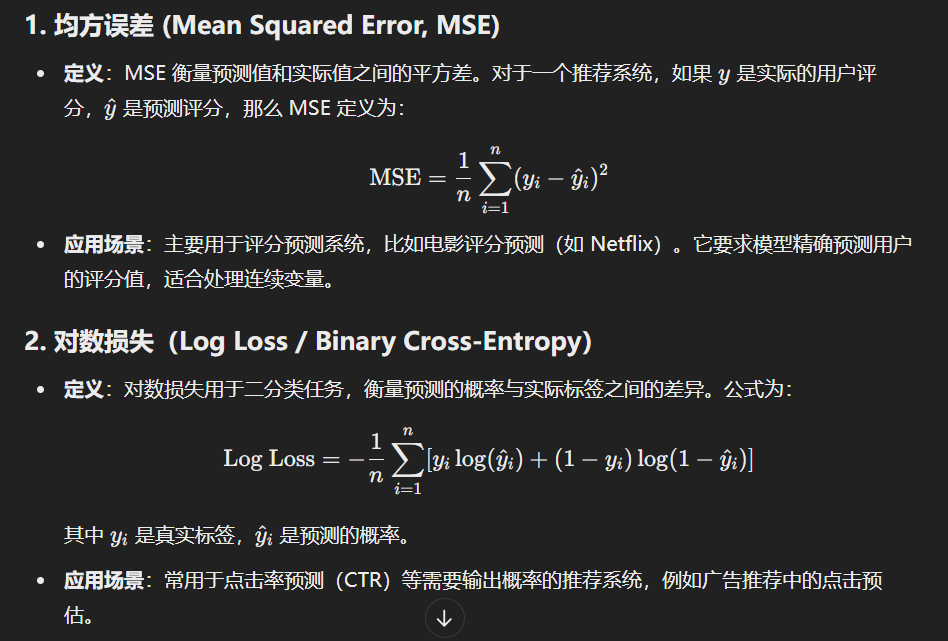
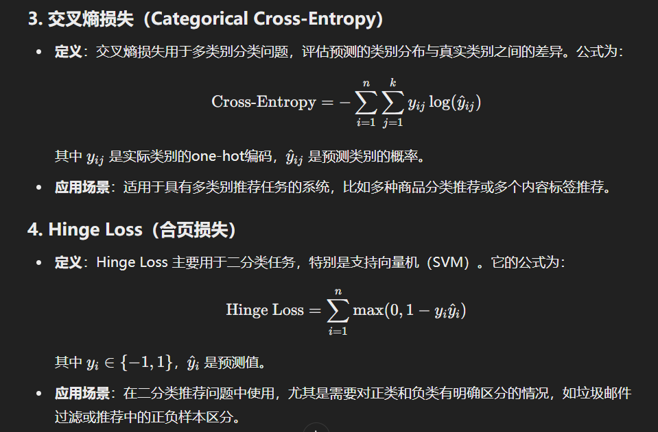
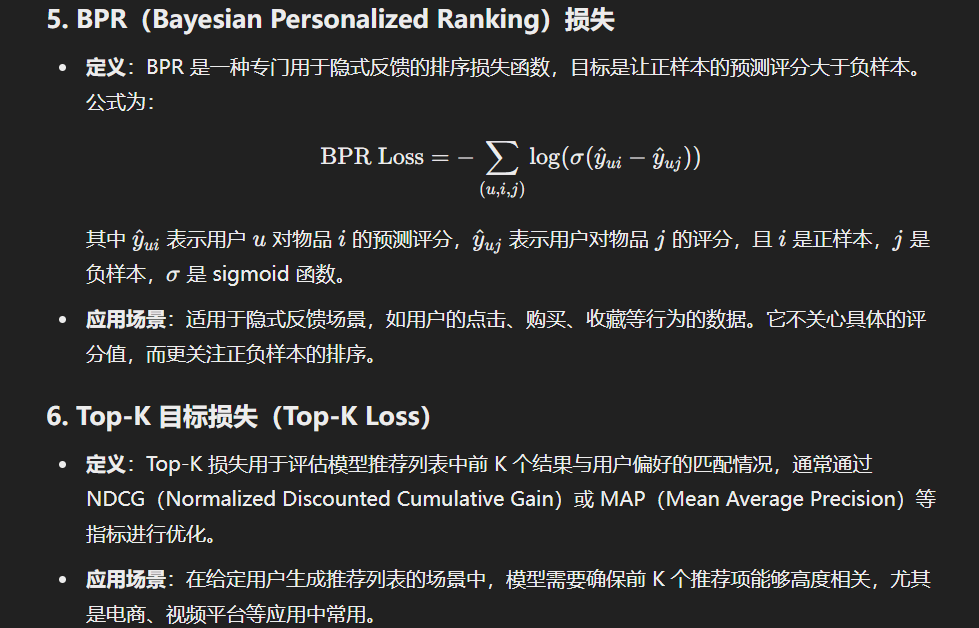
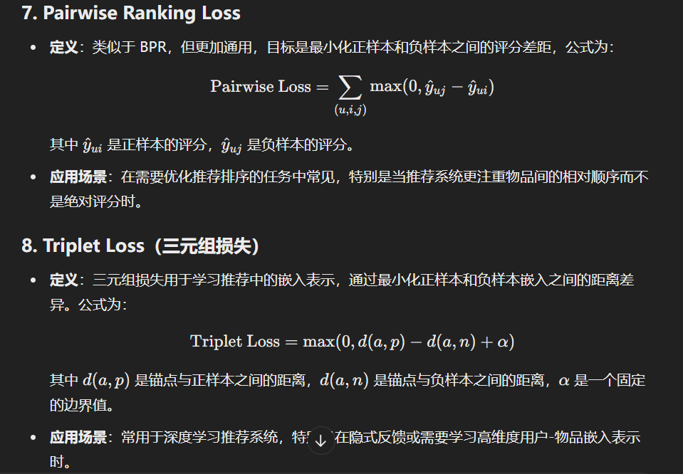

# 神经网络设计
## 介绍一下神经网络的初始化方法
  - 零初始化（Zero Initialization）
    - 方法: 所有权重初始化为零，偏置也初始化为零。
    - 缺点: 如果所有权重都初始化为零，那么在反向传播时每个神经元的梯度将会相同，导致它们在更新时完全同步。这使得所有神经元都学到相同的特征，无法发挥深度学习的优势。因此，零初始化不适用于权重的初始化。
  - 随机初始化（Random Initialization）
    - 方法: 以随机值初始化权重，通常使用均匀分布或正态分布的随机数。
    - 应用: 这种方法常用于简单的神经网络，但对于深层网络，随机初始化容易导致梯度消失或梯度爆炸问题。
    - 缺点: 随机选择的分布和范围对网络的收敛速度和稳定性有很大影响，不当的随机初始化会导致训练效率低下。
  - Xavier 初始化（Glorot Initialization）
    - 方法: Xavier 初始化通过正态分布或均匀分布随机初始化权重，其方差依赖于前一层的输入神经元数量。具体来说，如果使用正态分布，均值为0，方差为1/n，其中n是前一层的神经元数量。如果使用均匀分布，则权重从区间[-sqrt(6/n), sqrt(6/n)]中抽取。
    - 优点: Xavier 初始化通过平衡输入和输出的方差，防止信号在前向传播时过快消失或膨胀，适合用于 sigmoid 和 tanh 激活函数的网络。
    - 应用: 常用于多层感知机（MLP）和卷积神经网络（CNN）。
  - He 初始化（He Initialization）
    - 方法: He 初始化是 Xavier 初始化的改进版，专为 ReLU 和其变体激活函数设计。正态分布的均值为0，方差为2/n，其中n是前一层的神经元数量。对于均匀分布，权重从区间[-sqrt(6/n), sqrt(6/n)]中抽取。
    - 优点: He 初始化考虑到 ReLU 激活函数会将部分输入置为零，因此通过增加方差来增强前向传播中的信号。
    - 应用: 广泛用于深层卷积神经网络和其他使用 ReLU 激活函数的网络。
  - Lecun 初始化
    - 方法: Lecun 初始化方法与 He 初始化类似，但方差设为1/n，其中n为前一层的神经元数量。该初始化更适合 sigmoid 和 tanh 激活函数。
    - 应用: 特别适用于使用 sigmoid 激活函数的神经网络，如 LSTM 和其他递归神经网络（RNN）。
  - Orthogonal 初始化（Orthogonal Initialization）
    - 方法: 通过生成随机矩阵并使用正交分解（如 QR 分解）来初始化权重矩阵，使得矩阵之间保持正交性。权重矩阵的特征值保持不变，且其所有列均正交。
    - 优点: 正交初始化可以帮助深层网络避免梯度消失或梯度爆炸问题。
    - 应用: 常用于 RNN 和深度卷积网络中，特别是在网络非常深或序列特别长的情况下。
      - 原因：
        - 梯度消失：如果网络的权重矩阵在反向传播时的特征值小于 1，梯度会随着时间步逐渐减小，最终接近零。这样，模型难以捕捉到远时间步的依赖关系。
        - 梯度爆炸：如果网络的权重矩阵的特征值大于 1，梯度会随着时间步逐渐增大，导致训练不稳定，甚至模型无法收敛。
        - 在反向传播过程中，RNN 的梯度是通过重复乘以权重矩阵得到的。如果权重矩阵是正交的，那么其特征值的模是 1，这意味着在前向和反向传播时，输入信号和梯度的幅度不会随着时间步显著放大或缩小。
  - 正态分布与均匀分布初始化（Normal and Uniform Initialization）
    - 方法: 权重初始化为从正态分布或均匀分布中抽取的随机值。均匀分布通常用作 Xavier 初始化，而正态分布则用于 He 初始化等。
    - 应用: 可根据网络的具体需求调整分布的均值和方差。
  - 自适应初始化（Adaptive Initialization）
    - 方法: 在一些先进的神经网络架构中，初始化可以是自适应的，根据输入数据动态调整初始权重。例如，在 Batch Normalization 或 Layer Normalization 中，层的参数会在训练过程中自动适应和调整。
  - 实际应用中的注意事项
    - 激活函数: 初始化方法通常与激活函数相关联，不同的激活函数可能需要不同的初始化方法。例如，ReLU 常与 He 初始化配合使用，而 sigmoid 和 tanh 常与 Xavier 初始化配合。
    - 网络深度: 随着网络的深度增加，初始化的选择变得更为关键。深层网络容易出现梯度消失或梯度爆炸问题，因此需要更仔细地选择初始化方法。
    - 批归一化（Batch Normalization）: 使用批归一化可以在一定程度上缓解对初始化的依赖，但仍需注意初始权重的适当选择。

## 介绍一下神经网络的优化器有哪些。
  - 梯度下降法（Gradient Descent）
    - 批量梯度下降（Batch Gradient Descent）: 计算整个训练集上的损失梯度，使用该梯度更新参数。这种方法通常需要较多的计算资源，且内存占用较大，但收敛较稳定。
    - 随机梯度下降（Stochastic Gradient Descent, SGD）: 每次使用一个样本计算梯度并更新参数，更新频繁，计算量小，但由于每次只基于一个样本更新，可能导致训练过程中损失波动较大。
    - 小批量梯度下降（Mini-batch Gradient Descent）: 结合了批量梯度下降和随机梯度下降的优点，每次使用一个小批量的数据计算梯度。这种方法在计算效率和收敛稳定性上取得了平衡，是当前最常用的优化器之一。
  - 动量法（Momentum）
    - 动量梯度下降（SGD with Momentum）: 在标准 SGD 的基础上，引入了动量的概念。动量方法通过在更新时保留之前的梯度，使得优化过程更平滑，能够更快地收敛到最优解，并有助于避免局部最优解。
  - RMSProp（Root Mean Square Propagation）
    - RMSProp 是为了解决 Adagrad（另一种自适应学习率优化器）在训练过程中学习率不断降低的问题。它通过引入指数加权移动平均（Exponential Moving Average, EMA），在每次更新参数时调节学习率，从而使得模型在训练后期仍能保持较快的学习速度。
  - Adam（Adaptive Moment Estimation）
    - Adam 是目前最为流行的优化器之一，结合了 RMSProp 和动量法的优点。它通过同时计算梯度的一阶矩估计（动量）（均值）和二阶矩估计（RMSProp）（方差），并根据这些估计值来调整每个参数的学习率。Adam 在许多应用场景中表现优异，特别是在处理稀疏梯度和高维数据时。
  - Adadelta
    - Adadelta 是 Adagrad 的改进版，旨在解决 Adagrad 的学习率单调下降问题。与 RMSProp 类似，它利用窗口中梯度的均方根来调整学习率，但不同的是，Adadelta 是无学习率（learning rate-free）的，通过更新步长的动态调整避免了学习率手动设置的问题。
  - Nesterov 加速梯度（Nesterov Accelerated Gradient, NAG）
    - NAG 是对动量法的改进。与标准动量法不同，NAG 在计算当前梯度之前先对未来的梯度方向进行预测，然后根据这个预测值进行更新。这样做可以在更早的时间纠正参数更新的方向，从而进一步加快收敛速度。
  - AdaMax
    - AdaMax 是 Adam 的一个变体，基于无穷范数（infinity norm）来更新参数。它在某些情况下比 Adam 更稳定，尤其是在非常高维的数据集上。
  - Nadam
    - Nadam 是将 Nesterov 加速梯度与 Adam 结合的一种优化器，试图在提升 Adam 的收敛速度的同时，保留其原有的稳定性。
  - L-BFGS（Limited-memory Broyden–Fletcher–Goldfarb–Shanno）
    - L-BFGS 是一种准牛顿法优化器，适用于小型数据集和高精度需求的任务。由于内存需求较高，计算复杂，L-BFGS 较少用于大规模神经网络，但在一些特定场景中可以达到更好的收敛效果。
  - 选择优化器的考虑因素
    - 数据规模和复杂度: 小型数据集通常适合 L-BFGS 之类的高精度优化器，而大规模数据集更适合 SGD 或 Adam 这类快速收敛的优化器。
    - 模型类型: 卷积神经网络（CNN）、循环神经网络（RNN）等不同类型的网络可能对不同优化器有不同的需求。
    - 硬件资源: 如计算能力和内存限制，影响了优化器的选择。

##  对Embedding的理解
  - Embedding 的核心思想是将高维稀疏数据转换为低维稠密向量。
  - 包括：word embedding，句子embedding，图embedding， 用户商品embedding
  - 尽管 Embedding 能有效捕捉数据的内在结构，但其可解释性往往较差

##  sigmoid
  - 二分类任务输出层

## softmax
  - 将一个n维的输入向量转换为一个概率分布
  - 可以作为多分类任务输出层

- 推荐系统损失函数

##  过拟合：
  - 模型在训练数据上表现非常好，但在新数据或测试数据上表现较差。通常发生在模型过于复杂时，能够很好地记住训练数据中的细节和噪声。缺乏对新数据的泛化能力。
    - 原因：
    -模型过于复杂，例如层数太深或特征太多。
    -训练数据不足，导致模型过度依赖有限的数据。
    -训练时间过长，模型学会了数据中的噪声。
  - 解决办法：
    - 正则化（Regularization）
      - L1产生稀疏模型
      - L2减小权重的大小
    - 交叉验证
    - 减小模型复杂度
    - 增加增强数据：使模型更好泛化
    - 停止训练（early stop）
    - 使用dropout：丢弃部分神经元来防止模型过拟合,默认全连接0.5，卷积0.2或0.3。为了不破坏连续性，RNN为0，除非指定其他值。
    - batchnorm或者layernorm：主要用于加速训练，防止梯度消失。一定程度防止过拟合，与relu一起用一定程度缓解dead relu。
##  欠拟合
  - 欠拟合是指模型在训练数据和测试数据上的表现都不好，无法有效地捕捉到数据中的模式。通常是因为模型过于简单，无法充分学习到数据的复杂性。
  - 原因：
    - 模型过于简单
    - 特征不足或特征表达弱
    - 训练时间短
  - 解决办法：
    - 增加模型复杂度
    - 特征工程
    - 增加训练时间
    - 调参
    
## 为什么需要BatchNorm？
  - 深度神经网络模型的训练为什么会很困难？其中一个重要的原因是，深度神经网络涉及到很多层的叠加，而每一层的参数更新会导致上层的输入数据分布发生变化，通过层层叠加，高层的输入分布变化会非常剧烈，这就使得高层需要不断去重新适应底层的参数更新。
  - Google 将这一现象总结为 Internal Covariate Shift!!! 简称 ICS
##  ICS问题是什么导致的？
  - 上层参数参数需要不断适应新的输入数据分布，降低了学习速度
  - 下层输入变化可能趋近于变大或者变小，导致上层落入包和区，使得学习过早停止
  - 每层更新会影响其他层，因此每层更新策略尽可能谨慎

##  BN算法如何防止过拟合的？BN算法如何进行网络训练加速的？
  - 在训练中，BN的使用使得一个mini-batch中的所有样本都被关联在了一起，因此网络不会从某一个训练样本中生成确定的结果。
  - 其实这句话的意思是，BN的使用，使得网络在训练时不依靠于某一个样本进行更新或者输出，而是依赖于整个batch size的数据，这样参数不会太依赖于某一个数据，而是一个batch size内的数据，一定程度上防止了过拟合。

  - BN是通过将每次卷积后的数据分布拉到指定分布域内（比如标准高斯分布），这样在参数学习时，由于数据分布基本相同，学习起来速度会变得很快。
##  L1，L2正则化
- L1 正则化：在实际项目中，L1 正则化用于需要特征选择的任务，尤其是高维数据如文本分类、基因数据分析等场景中，可以有效筛选出重要的特征。

- L2 正则化：在深度学习中，L2 正则化（通常称为权重衰减）被广泛应用，可以平滑神经网络的权重，从而提高模型的泛化能力。

- Elastic Net：同时结合 L1 和 L2 正则化，能够兼具稀疏性和鲁棒性，特别适合于高维且特征相关性较强的场景。这在工业中的推荐系统或特征筛选任务中较为常见。
  缺点：计算复杂度增加， 调参

## 为什么dropout可以解决过拟合问题
- 集成学习的作用：5个模型，3正二负取其正。不同网络产生不同的拟合，但是多个模型可以对冲掉风险。dropout破坏神经元的开启，达到取平均的过程，从而整体减小过拟合。
- 减少神经元之间复杂的共同适应关系：在标准神经网络中，某些神经元或特定的神经元组合可能会对训练数据产生强烈的适应性，即过于依赖某些特定的特征。这种共适应性使得模型在训练数据上表现很好，但在新数据（测试数据）上则会表现较差，导致过拟合。
- 减少参数更新依赖：在每次前向传播过程中，Dropout 会随机丢弃部分神经元，导致模型在每次训练时都基于不同的网络结构进行更新。通过这种随机性，Dropout 使得模型参数不至于朝着某个特定方向进行过度优化，避免参数陷入局部极小值或过拟合到训练数据中的噪声。
- 增加数据噪声，提高泛化能力： 从另一个角度看，Dropout 在训练过程中相当于向神经网络的中间层添加了随机噪声。这种噪声迫使模型学会更加鲁棒的特征，减少模型对训练数据的过度拟合，提高在未见数据上的泛化能力。

## 梯度与什么有关
- loss
- 激活函数求导
- w：权重值
- 输入值x
## 梯度消失原因（Vanishing Gradient）
- 在神经网络的反向传播过程中，梯度值通过链式法则逐层传播。如果激活函数（如 sigmoid 或 tanh）在某些区域内的导数非常小（sigmoid 和 tanh 的导数在接近 0 或 1 时很小），梯度在传递时会不断衰减。当网络层数较深时，传到前面层的梯度会接近于零，导致这些层的参数几乎不再更新。
- 长时间序列任务中的 RNN 也会遇到类似问题，当梯度传递回更早的时间步时，梯度会逐渐缩小，导致早期时间步的信息无法有效更新。
- 解决办法：
  - 使用不同的激活函数： ReLU（Rectified Linear Unit） 是一种常见的解决梯度消失问题的激活函数。ReLU 在正数区域导数为 1，避免了梯度在反向传播时逐层缩小。 Leaky ReLU 或 Parametric ReLU 也可以用来替代标准的 ReLU，它们在负数区域有小的梯度。
  - 梯度裁剪（Gradient Clipping）： 通过限制梯度的最大值来防止梯度过小，使得在传播时不会进一步缩小。
  - 使用批量归一化（Batch Normalization）： 在每一层对激活值进行标准化，能够稳定梯度的分布，缓解梯度消失问题。
  - 合适的权重初始化：  
    - Xavier 初始化 和 He 初始化 是两种常见的权重初始化方法，能够防止梯度在传递过程中变得过小或过大。 
    - Xavier 初始化适合 sigmoid 或 tanh 激活函数，He 初始化更适合 ReLU 和其变种。
  - 残差层：残差网络的引入主要是为了解决网络退化问题，其次才是梯度消失/爆炸问题。
## 梯度爆炸（Exploding Gradient）
- 和梯度消失一样，梯度爆炸也是由于链式法则中的梯度相乘导致的。如果某些层的梯度较大，那么在多层传播后梯度会成倍增长，导致后面层的梯度极其大，模型的参数更新会变得非常剧烈。
- （RNN）中常见，当处理长时间序列数据时，梯度沿着时间轴传播，可能在早期时间步急剧增大。
- 解决办法：
  - 梯度裁剪（Gradient Clipping）： 梯度裁剪是最常用的解决梯度爆炸问题的技术。当梯度的范数超过某个阈值时，将其缩放到这个阈值以内。这样可以限制梯度的增长，防止梯度爆炸。
  - 权重初始化： 合理的权重初始化也有助于防止梯度爆炸。例如，Xavier 初始化和 He 初始化能够确保初始权重的分布适中，从而避免梯度的过快增长。
  - 正则化： L2 正则化可以帮助抑制模型参数过大，从而间接减少梯度爆炸的风险。 Dropout 也可以帮助防止网络的部分节点过度更新，减轻梯度爆炸的风险。

