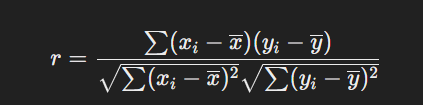

# 推荐系统 - 基本概念
- 介绍一下推荐算法的链路流程
- 特征工程怎么做
  - 特征构建： 主要包括对用户、物品和上下文信息的挖掘与组合：
    - 用户特征：包括用户的基本信息（如年龄、性别、地理位置）、行为特征（如浏览历史、点击率、购买记录）以及社交关系（如好友关系、关注的人）。
    - 物品特征：包括物品的基本属性（如类别、品牌、价格）、流行度（如总购买量、评价数）以及内容特征（如电影的导演、演员、题材）。
    - 上下文特征：包括时间特征（如一天中的时段、周末与工作日）、地理位置特征（用户当前的位置）、设备特征（如移动端或PC端）。
      
  - 特征提取： 特征提取是指从原始数据中提取出能够反映用户行为和偏好的特征，常用的方法包括：
    - 统计特征：从历史数据中计算如点击次数、购买次数、评价分数等统计量。
    - 时间序列特征：通过分析用户行为的时间序列数据提取趋势或周期性特征。
    - 嵌入特征：通过模型（如Word2Vec、DeepWalk等）将用户、物品或其他实体映射到低维向量空间。
    - 交互特征：结合用户和物品特征，通过交叉特征或二阶交互项来捕捉复杂的非线性关系。
      - 交叉特征：可以是离散特征的拼接或组合。例如，将用户的职业和居住城市拼接成“职业-城市”这样的新特征。这种组合在特征空间中形成了新的类别，使得模型可以独立对这些类别进行学习。
      - 二阶交互特征：主要是数值特征的乘积，如用户年龄与商品价格的乘积，或是嵌入向量的内积。这种方式能够捕捉到线性模型无法表达的非线性关系
        -  实现二阶交互的模型： 
          - 因子分解机（Factorization Machines, FM）：FM模型通过内积操作捕捉到特征之间的二阶交互，并且能够有效处理稀疏矩阵问题，适用于推荐系统中的用户-物品交互建模。
          - 深度因子分解机（DeepFM）：在因子分解机的基础上加入了深度神经网络部分，能够捕捉到更高阶、更复杂的交互特征。这种模型可以同时学习低阶和高阶的特征交互，兼顾了模型的准确性和复杂性。
          - Wide & Deep 模型：由Google提出的Wide & Deep模型结合了线性模型（Wide部分）和深度神经网络（Deep部分），Wide部分负责学习低阶的交互特征，而Deep部分则负责学习高阶的非线性交互。这种模型在广告点击率预测和推荐系统中得到了广泛应用。
      
  - 特征选择： 为了提高模型的训练效率和预测效果，需要选择最具信息量的特征
    - 过滤法：通过统计方法（如方差选择法, 相关系数法, 互信息法）对特征进行评分，选择得分高的特征。
      - 皮尔逊相关系数:两个变量之间的线性相关程度。它计算的是两个变量之间协方差与其标准差的比值 协方差是衡量两个随机变量之间关系的统计量
      - 互信息：基于信息论的方法，衡量两个变量之间共享的信息量，能够捕捉更复杂的非线性关系 其中，p(x,y) 是联合概率分布，p(x) 和  p(y) 是边缘概率分布。
    - 包裹法：通过模型（如递归特征消除RFE, Recursive Feature Elimination）来选择对模型效果影响最大的特征。
    - 嵌入法：利用模型的权重或者特征重要性度量（如随机森林的特征重要性、L1正则化等）来选择特征。
      - 随机森林:通过对决策树内部节点分裂所带来的不纯度减少量进行统计，生成特征重要性。
      - 随机森林:不纯度是用来衡量数据集混杂程度的指标。常用的不纯度指标包括基尼系数和熵
      - 随机森林:计算该特征在所有节点分裂中导致的不纯度减少总和，得到该特征在这棵树中的重要性
      - L1正则化: 通过增加所有系数的绝对值之和作为惩罚项，促使模型在训练过程中倾向于让某些系数w_i变为零
      - L1正则化: 使得模型最终选择少量具有显著影响的特征，而将不重要的特征对应的系数压缩为零，从而实现特征选择
    - 降维的方法：PCA，解释方差比例选择成分
      
  - 确认特征重要性： 特征重要性可以帮助理解模型，并进一步优化特征工程过程。常用的方法包括：
    - 基于模型的方法：利用树模型（如随机森林、梯度提升树）的特征重要性指标，或利用线性模型的系数值。
    - 基于置换的重要性评估：通过随机打乱某个特征的数据来观察模型性能的变化，变化越大说明该特征越重要。
      - 随机打乱，该特征的值将与原始样本不再对应，即破坏了该特征与目标变量之间的关联性
    - SHAP值：SHAP（SHapley Additive exPlanations）值能够解释每个特征对模型预测结果的贡献，适用于各种复杂模型。
      - SHAP的核心思想是将模型的预测结果看作是特征“合作”的结果，每个特征对最终预测结果的贡献通过其Shapley值来衡量。
      
  - 实际应用中的考虑
    - 特征交互与非线性：在实际应用中，用户和物品的交互往往是非线性的。可以考虑使用如FM（因子分解机）或DeepFM等模型来自动学习高阶交互特征。
    - 在线与离线特征更新：推荐系统需要应对实时性需求，因此部分特征（如用户的最新行为）需要在线更新，而长期稳定的特征（如用户基本信息）可以离线处理。
    - 特征漂移：随着时间推移，特征的分布可能发生变化（特征漂移）。需要持续监控和调整特征，以保持推荐系统的效果。

- 讲一讲推荐算法序列建模的模型
- 模型如何进行在线训练，和离线训练有什么区别
- 如何保持嵌入一致性的问题
- 针对高活用户和低活用户，计算AUC会有问题，高活用户的 AUC值比较置信，而低活用户的AUC值不置信，该如何处理？
- 开放性问题，优化观看时长，怎么设计模型？针对label的设置

# 神经网络设计
- 对Embedding的理解
- 介绍一下神经网络的优化器有哪些。
- 介绍一下神经网络的初始化方法
- sigmoid和softmax
- 交叉熵推导

# 评估指标
- 解释AUC

