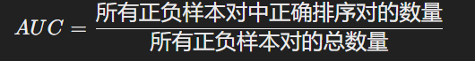

# 评估指标
- 解释AUC
  - 在推荐系统中，AUC 通常用于衡量模型在给定用户的推荐列表中，对正样本（用户感兴趣的物品）和负样本（用户不感兴趣的物品）进行正确排序的能力。
  - AUC > 0.5: 模型的排序能力优于随机排序，AUC 值越接近 1，说明模型越能够将用户感兴趣的物品排在不感兴趣的物品之前
  - AUC = 0.5: 模型的排序能力与随机排序相同，没有有效的区分能力
  - AUC = 1: 模型能够完美地将所有用户感兴趣的物品排在不感兴趣的物品之前
  - 正负样本的定义:
    - 正样本: 用户实际交互或感兴趣的物品（如点击、购买、评分较高的物品）。
    - 负样本: 用户未交互或不感兴趣的物品（这些物品可能随机选取，也可能根据用户历史行为来定义）。
  - 预测得分: 模型为每个物品生成一个预测得分，表示用户对该物品的兴趣程度。
  - 计算AUC：对于一个用户，计算所有正负样本对的得分。如果一个正样本的得分高于负样本，则记为一次正确排序。
  - AUC 就是所有正负样本对中正确排序对的比例
  - 优点：
    - 阈值无关: AUC 不依赖于特定的评分阈值，因此可以全面评估模型在不同评分水平下的排序能力。
    - 处理不平衡数据: 在推荐系统中，正样本（如点击、购买）通常远少于负样本。AUC 能够有效处理这种样本不平衡的情况，提供稳定的评估。
    - 衡量整体排序质量: AUC 能够反映模型对整个推荐列表的排序能力，而不仅仅是对单个物品的预测效果。
  - 局限：
    - 不能反映具体位置的效果: AUC 只考虑了正负样本对之间的相对顺序，无法直接反映推荐列表中某个位置上的具体效果。在实际应用中，推荐系统可能更加关注列表顶部位置的准确性，而 AUC 无法单独体现这一点。
    - 未考虑推荐结果的实际业务影响: AUC 是一个通用的排序评估指标，但不同应用场景下的业务目标不同，AUC 未必能完全反映模型的业务价值。例如，在某些场景下，模型的商业效果可能更多依赖于 Top-N 推荐的准确率。

- 针对高活用户和低活用户，计算AUC会有问题，高活用户的 AUC值比较置信，而低活用户的AUC值不置信，该如何处理？
  - 分层评估：高活跃、中活跃、低活跃
  - 权重调整：不同活跃度的用户群体赋予不同的权重
  - 数据增强：对于低活跃用户，可以通过数据增强方法（如生成更多模拟交互、利用相似用户的数据）来增加样本量
  - 跨用户融合：将多个低活跃用户的数据聚合在一起进行评估，以增加样本量。这种方法相当于把多个用户看作一个整体
  - 跨域
  - 其他指标
  - 个性化AUC评估
